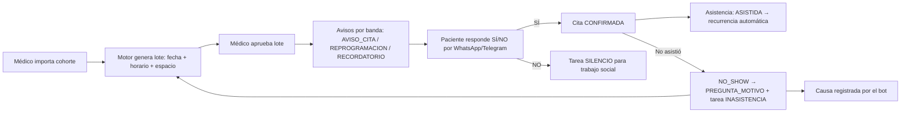

# HematoFlow

Sistema de citas del **Consultorio de Hematología del INSN** (Instituto Nacional de Salud del Niño, Perú).

Los pacientes —prioridad: zonas lejanas— reciben, confirman y reprograman sus citas mediante un agente conversacional en **WhatsApp/Telegram**. Un motor determinista propone fechas y **horarios concretos** por etiqueta de prioridad y **capacidad real del servicio** (estrategia de llenado: concentra citas hasta llenar un día antes de abrir el siguiente); **toda** creación/reprogramación de citas pasa por aprobación auditada del médico; silencios e inasistencias generan tareas con SLA para el asistente social.

## Arquitectura

- **API única** (Bun + Hono + Prisma/PostgreSQL): `src/index.ts` (puerto `PORT`, default 3100).
- **Panel web** (React SPA, Vite + TypeScript): `web-app/` — cliente HTTP de la API (sin imports de dominio). `bun run web` sirve `web-app/dist` y proxya `/api/*` → `API_BASE_URL`; en dev `bun run web:dev` (Vite en :5173).
- **Bot** (chatbot clásico if/else como **workflow Mastra determinista**, sin LLM): `chatbot.workflow.ts` compone pasos (`lookup`) y ramas condicionales exclusivas (CONFIRMAR/NEGAR/CONSULTAR/motivo/fallback) con clasificadores por reglas (`ReglasIntencionAdapter`/`ReglasCausaAdapter`).
- **Motor de planificación**: greedy determinista puro (`src/modules/planificacion/domain/planificador.ts`): orden estable por etiqueta → fechaObjetivo → id; **llenado de días** (elige el día válido más temprano con ventana; la ventana más temprana entre los espacios). Jamás sobrecupa ni solapa.
- **Cron** (`src/infrastructure/cron/hematoflow.jobs.ts`): dispatcher de avisos (cada minuto) + reintento de webhooks + detectores de silencios y no-shows (cada 5 min).

## Setup

Requisitos: Bun ≥ 1.3, Docker (Postgres).

```bash
# 1) Postgres local
docker run -d --name hematoflow-postgres \
  -e POSTGRES_USER=pausa -e POSTGRES_PASSWORD=pausa_dev_2026 \
  -e POSTGRES_DB=hemato_flow -p 5433:5432 postgres:16-alpine

# 2) Entorno
cp .env.example .env   # completar AES_KEY, JWT_SECRET y credenciales

# 3) Dependencias e instalación de BD
bun install
bun run db:deploy      # migraciones
bun run db:seed        # usuarios + config + tipos + profesionales + cohort demo + capacidad

# 4) API y panel (dos procesos)
bun run dev            # API en :3100
bun run web            # panel en :3002 (sirve dist/ + proxy /api)
```

Usuarios demo: `admin`/`admin-2026`, `medico`/`medico-2026`, `social`/`social-2026`.

## Comandos

| Comando | Qué hace |
|---|---|
| `bun run dev` | API con watch (puerto `PORT`) |
| `bun run typecheck` | Typecheck backend |
| `bun test` | Tests unitarios (planificador, aprobación, bot, firma Twilio) |
| `bun run web:build` / `web:check` | Build / typecheck del panel |
| `bun run web` / `web:dev` | Panel servido / Vite dev |
| `bun run db:deploy` / `db:seed` / `db:migrate` / `db:studio` | Prisma |
| `bun run sim` | Simulador E2E completo por asserts (requiere API arriba) |

## Flujo del sistema



## Endpoints principales

| Ruta | Roles |
|---|---|
| `POST /api/auth/login` | público |
| `GET/POST /api/pacientes`, `PATCH /api/pacientes/:id`, `POST /api/pacientes/importar`, `POST /api/pacientes/:id/hospitalizacion`, `POST/DELETE /api/pacientes/:id/responsables` | MEDICO, ADMIN |
| `GET/POST /api/profesionales`, `PATCH /api/profesionales/:id`, `GET /api/profesionales/carga` | GET: staff; resto: MEDICO, ADMIN |
| `GET /api/tipos-procedimiento` | staff |
| `GET/PUT /api/capacidad` (+ `GET /api/capacidad/ocupacion`) | GET: staff; PUT: MEDICO, ADMIN |
| `POST /api/planificacion/lotes` · `GET /api/planificacion/lotes[/:id]` · `POST .../aprobar|rechazar` | MEDICO, ADMIN |
| `GET /api/citas` · `POST /api/citas/:id/asistencia` · `POST /api/citas/:id/cancelar` | citas/asistencia: staff citas; cancelar: MEDICO, ADMIN |
| `GET /api/avisos` | staff |
| `GET /api/tareas-sociales`, `POST /api/tareas-sociales/:id/tomar|resolver` | ASISTENTE_SOCIAL, ADMIN |
| `GET /api/estadisticas/causas` | staff |
| `GET /api/auditoria` | MEDICO, ADMIN |
| `GET/PUT /api/configuracion` | MEDICO, ADMIN |
| `POST /webhooks/twilio`, `POST /webhooks/telegram` | público (firma/secreto) |

Privacidad: `GET /api/pacientes` nunca expone el teléfono; este solo aparece en el detalle de `TareaSocial` (ASISTENTE_SOCIAL/ADMIN) con registro `VER_NUMERO` en auditoría. Toda mutación relevante queda en la tabla append-only `Auditoria`.

## Paginación y filtros

Los listados (`pacientes`, `citas`, `lotes`, `avisos`, `tareas-sociales`, `profesionales`, `profesionales/carga`, `auditoria`) aceptan `?pagina=1&limite=50` (limite máx 200) y responden `{ items, total, pagina, limite }` (+ `resumen` de conteos en pacientes/tareas). Filtros disponibles:

| Endpoint | Filtros |
|---|---|
| `GET /api/pacientes` | `etiqueta`, `banda`, `activo`, `hospitalizado`, `q` (nombre) |
| `GET /api/citas` | `desde`, `hasta`, `estado`, `etiqueta`, `banda`, `q` (nombre del paciente) |
| `GET /api/planificacion/lotes` | `estado` |
| `GET /api/tareas-sociales` | `estado`, `tipo`, `q` (nombre del paciente) |
| `GET /api/avisos` | `estado`, `citaId` |
| `GET /api/profesionales[/carga]` | `activos`, `q` (nombre/especialidad) |
| `GET /api/auditoria` | `entidad`, `entidadId`, `limit`, `pagina` |

## Simulador E2E

`bun run sim` ejercita el flujo completo contra la API en ejecución:

cohorte → capacidad → lote → aprobación → avisos **ENVIADOS** por el dispatcher (mensaje con fecha/hora) → confirmación por webhook Twilio (firma HMAC-SHA1 real, `TWILIO_AUTH_TOKEN=sim-token`) → no-show → causa `TRANSPORTE` → reprogramación aprobada (`REPROGRAMACION`, la cita previa NO_SHOW no se re-bloquea) → recurrencia (`frecuenciaDias` avanza `fechaObjetivo`) → tarea de silencio.

Cada paso imprime un assert (`✅`/`❌`) y el script falla con código 1 si alguno falla.

## Variables de entorno clave

`DATABASE_URL` (BD `hemato_flow`), `TWILIO_*`, `TELEGRAM_*`, `AES_KEY`/`AES_SALT` (cifrado reversible de números), `JWT_SECRET`, `PORT`, `WEB_APP_PORT`, `API_BASE_URL`, `ADMIN_*`/`MEDICO_*`/`SOCIAL_*` (credenciales de seed). Booleans: `"true"`/`"1"`.
